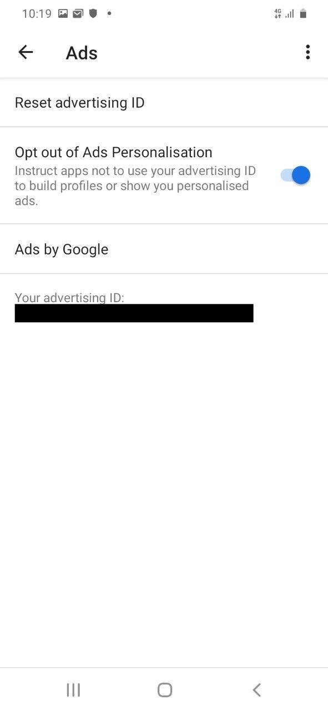

# Title #
Opt out of targeted ads and renew your Ad ID on Android

# Summary #
Advertisers need to uniquely identify you across apps and websites in order to aggregate data they might collect about
you. To do so, your device is assigned Ad ID, which it then shares with advertisers so they can serve you ads
based on your data. In this guide you'll learn how to avoid targeted advertisement either by periodically resetting your
Ad ID or by opting out completely.

# Body #

> **Warning**: Android settings may be placed on different menus depending on your distribution. Please check your
> distribution's documentation for more information.

### Opt out of targeted advertising ###
To prevent that data collected from your device is used to serve you ads, you can opt out of targeted advertisements.
Targeted advertisements pose a serious privacy risk since they are served to you based on data points such as your
location history, your name and address, the music you listen to, or how many levels you've completed in your favourite
game.

To opt out of targeted ads from any other data points, open the **Settings** app and go to **Privacy > Ads** and
enable **Opt out of Ads Personalisation** (Fig. 1).

### Renew your Ad ID ###
To renew your Ad ID on Android, open the **Settings** application, navigate to **Privacy > Ads** and then click on
**Reset advertising ID...**.
