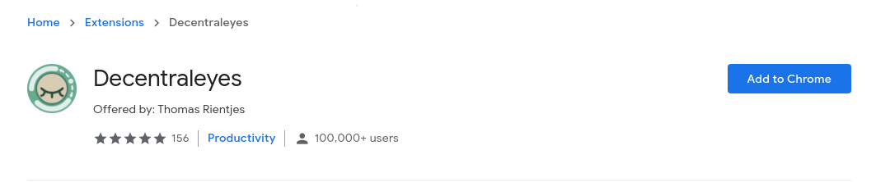
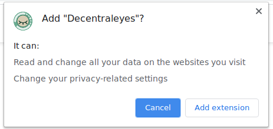
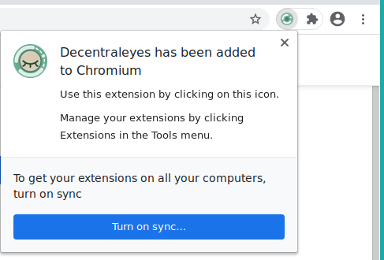
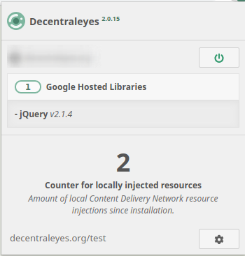

# Title  #
Install a CDN-emulator on Chrome - Decentraleyes

# Summary #
<!-- Websites are increasingly relying more on large third-parties for content delivery. As a result, such third-parties
can --> <!-- track your online activity while you browse the web. -->

Decentraleyes is a browser add-on used for local content delivery network (CDN) emulation, that protects your privacy by
evading large CDNs (e.g. Google). In this guide, you'll learn how to install Decentraleyes on Chrome to prevent CDNs
from tracking your online activity.

# Body #

### Installation ###
Like any other add-on, install Decentraleyes by visiting the [Chrome Web
Store](https://chrome.google.com/webstore/detail/decentraleyes/ldpochfccmkkmhdbclfhpagapcfdljkj)
and clicking **Add to Chrome** (Fig. 1) and then clicking on **Add extension** when
prompted (Fig. 2).

Upon successful installation a notification appears on the top-right corner, and the Decentraleyes icon is added to the
extension menu on your toolbar (Fig. 3). To pin the icon on the toolbar, click the extension menu, and then click the
pin next to the Decentraleyes icon. When you visit a website, Decentraleyes automatically blocks connections to
third-party CDNs and injects the assets locally, which you can check by clicking the icon (Fig. 4).

You can test the add-on by visiting the [Decentraleyes testing utility](https://decentraleyes.org/test/). If you are
interested in more advanced usage, visit the [official documentation
page](https://git.synz.io/Synzvato/decentraleyes/-/wikis/).
