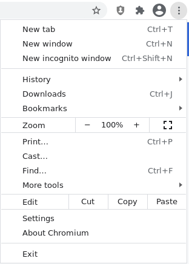

# Title #
Adjusting Chrome (and derivatives) settings to enhance your online privacy

# Summary #
In this guide you'll learn how to configure your Chrome browser settings to harden your online privacy.

# Body #

### Changing settings in Chrome menu ###
To access the settings, click on the three-dot menu on the upper right and then press **Settings** (Fig. 1).

#### You and Google ####
On the Settings page, click on **You and Google** > **Sync and Google Services**. Disable **Autocomplete searches and
URLs** and **Make searches and browsing better** to prevent this data from being sent to Google's servers (Fig. 2).

.

##### Site settings #####
On the permissions section, enable **Ask before accessing** on **all** permissions, and disable **Background sync**.
Scroll to the bottom of the page and click on **Additional content settings**, and disable **Ads**.

### Advanced settings ###
Open the advanced settings page and scroll to **System**. Disable **Continue running background apps when Chrome is
closed**.
