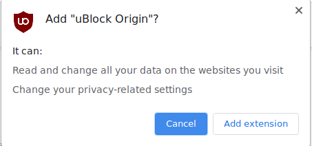
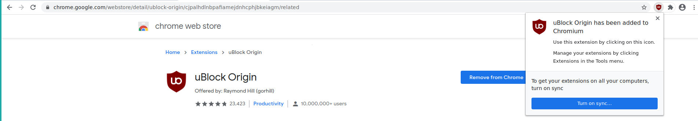

# Title  #
Install an ad-blocker on Chrome - uBlock Origin

# Summary #

Online tracking and advertisement services are a severe threat for your online
privacy, since they follow you everywhere and collect as much data as they can,
over which you have no control. As such, when browsing the web, it is critical
to block these services from communicating with our browser. uBlock Origin is a
general purpose blocker for web browsers that by default blocks ads, trackers,
and malware sites. We highly recommend it because it's fast and user-friendly,
has sane defaults with impeccable results, and, unlike many others (which we
advise **against**), does not collect nor process user data of any kind.

In this guide, you'll learn how to install uBlock Origin on Chrome to block
malicious ads, trackers, and websites.
# 

### Installation ###
Like any other add-on, install uBlock Origin by visiting the [Chrome Web
Store](https://chrome.google.com/webstore/detail/ublock-origin/cjpalhdlnbpafiamejdnhcphjbkeiagm)
and clicking **Add to Chrome** (Fig. 1) and then clicking on **Add extension**
when prompted (Fig. 2).

Upon successful installation a notification appears on the top-right corner, and
the uBlock Origin icon is added to the extension menu on your toolbar (Fig. 3).
To pin the icon on the toolbar, click the extension menu, and then click the pin
next to the uBlock Origin icon. When you visit a website, uBlock Origin
automatically blocks malicious trackers and ads, which you can check by clicking
the icon (Fig. 4).

uBlock Origin is a powerful, highly configurable tool to block any network
request on your browser. If you are interested in more advanced usage, visit the [official
documentation page](https://github.com/gorhill/uBlock/wiki).
