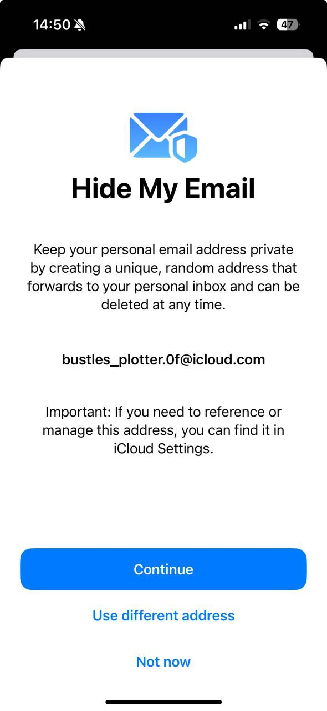
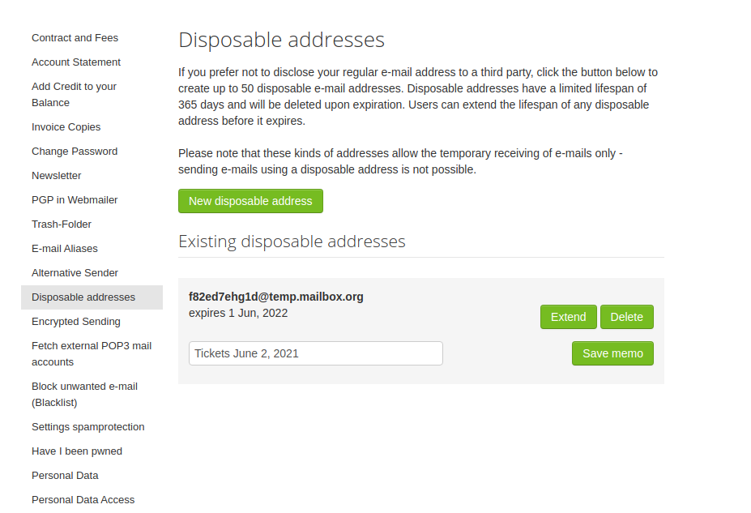
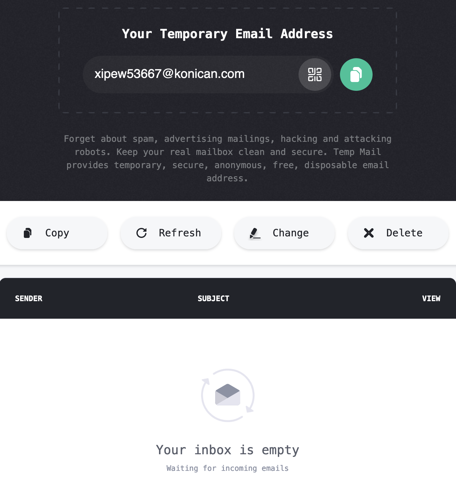

# Title
A guide to setting up disposable email addresses

# Summary
Disposable email addresses protect you from unwanted spam and phishing attempts in your personal email inbox, online tracking, and other forms of data abuse, providing you with a strong digital self-defence mechanism.

# Body

The practice of buying and selling email addresses is a common one among digital data brokers. Say you register at an online shop to buy an item from a brand. The shop can then sell your email address to that same brand, so they can advertise to you directly in your email inbox. This is called targeted advertising, and we have [written about its privacy implications to you as a digital citizen](7). Of course, this is not the only cause for trading email addresses. 

For instance, suppose you create an account for a website, using your personal email address, which is later a victim of a data leak. Most likely, your email address and the password you used to register are leaked. If an attacker gets a hold of this data, they can target different accounts of yours, provided you used the same personal email address. This is an even greater security risk if you [don't use a password manager](guide-passwords.md) to avoid reusing passwords.

As such, from a privacy and security standpoint, you should avoid handing out your email address to untrusted entities as much as possible. Instead, you can use *disposable email addresses* that mask your identity to protect your digital privacy. The idea is that you use a different, unique, preferably random email address across untrusted online services to prevent data brokers from tracking you, and your identity from being shared. When you no longer need such an address (e.g. for one-time online purchases), you can dispose it without affecting your personal email account.

This guide covers different solutions to creating and managing disposable email address depending on your operating system and email provider.

+ If you are on iOS or macOS and **have an iCloud+ subscription**, you can use Apple's Hide My Email service. This will generate random, unique email addresses for you to use online or in apps, so you don't share your personal email address. Messages sent to this address will be forwarded to your inbox. To learn how to setup Hide My Email, see [here](2).

+ Some email clients (e.g. Fastmail, Mailbox, Protonmail, Nordmail) provide this feature in their plans, allowing you to create unique, random disposable addresses. Messages sent to this addresses are forwarded to your inbox, and you can dispose of them when you no longer need them. To learn how to set up disposable addresses, refer to your provider's manual. 

+ You can use online email services to create disposable addresses. Services such as [Temp Mail](3) or [10 Minute Mail](4) allow you to create unique, temporary email addresses to use online. Since these will expire after a period of time, they should only be considered for one-time account uses. For permanent uses, you can use services such as [Firefox Relay](5) or [IronVest](6) which provide you with secure email addresses and forward messages sent there to your inbox. Note that, in most cases, websites providing this service for free should not be considered for secure communications, given their privacy policies. For such cases, consider using a secure email client that provides this feature.

The solutions presented above allow you to generate disposable email addresses with ease, in most cases delivering messages straight to your inbox, while preventing your personal email address from being shared. Whenever possible, we recommend you resort to this workflow to protect your digital privacy. Note that this has an interesting side effect: if you generate a disposable address for an online service, and suddenly start receiving email from another source, then you know the service has granted access to your address (and perhaps other data) to a third party.

As a closing thought: want to check if your email has ever been (publicly) leaked? Visit [this](1) website.

[1]: https://haveibeenpwned.com
[2]: https://support.apple.com/en-gb/guide/icloud/mme38e1602db/1.0/icloud/1.0
[3]: https://temp-mail.org/en/
[4]: https://10minutemail.com/
[5]: https://relay.firefox.com/
[6]: https://ironvest.com/masked-email/
[7]: https://privacyinternational.org/learn/micro-targeting