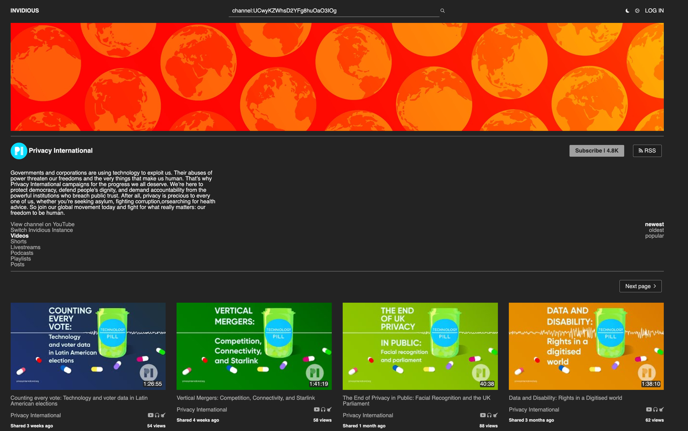

# Title
A guide for using privacy-focused alternative frontends to mainstream websites

# Summary
Popular Internet platforms, such as YouTube or Twitter, are not particularly famous for respecting your privacy. As a solution, to preserve your privacy while still being able to access the content of these platforms, you can use alternative front-ends. In this guide you will learn how to choose and setup alternative front-ends on your desktop and mobile devices.

# Body

Many mainstream Internet platforms, such as YouTube and Twitter, often collect extensive user data, track online activities, and employ algorithms to create content recommendations based on individual preferences. For a privacy-conscious user, this is nothing short of a nightmare. As a solution, you may opt for alternative front-ends — that is, a different website for the same content — to mitigate these privacy risks and reduce your digital footprint. By using alternative interfaces, you can avoid some of the data tracking mechanisms employed by major platforms, thus preserving a higher level of anonymity and control over your online presence.

Alternative front-ends may prioritize open-source and decentralized models, offering users more transparency and control over how their data is handled (e.g. not storing it on the cloud). Decentralized platforms often distribute data across multiple servers, reducing the risk of centralized data breaches. The absence of targeted advertisements that are prevalent on mainstream platforms, [which poses a high risk of privacy infringement](13), is typical in alternative front-ends, as they adopt different monetization models that don't rely on extensive user profiling and data collection (e.g. donations). Opting for alternative front-ends minimizes your exposure to certain privacy risks associated with popular, data-driven platforms.

### Alternative front-ends

There are many available alternative front-ends for popular online platforms. When looking for an alternative front-end, you should consider the following aspects:

1. **Data handling practices**: Evaluate how the alternative front-end manages user data. Opt for platforms that minimize data collection — preferably keeping it local-only — and have transparent privacy policies. Look for alternatives that prioritize user privacy by avoiding excessive tracking and data retention practices.
2. **Open Source and transparency**: Choose alternative front-ends that are open source and transparent about their codebase. Open-source projects allow users to inspect the code, fostering trust and ensuring that the platform operates with integrity. Since the code is available, anyone is free to inspect it for possible attacks (e.g. see [here](4) for an example where a user detected a privacy violation in a YouTube alternative instance, leading the project developer to remove it from the list of suggested instances.)
3. **Decentralization and user control**: Look for alternatives that follow decentralized models and provide users with greater control over their data. Platforms that distribute data across multiple instances or offer features allowing users to manage their information effectively contribute to a more privacy-centric experience. Decentralized systems also reduce the risk of single-point failures and large-scale data breaches.

Nitter and Invidious, alternative front-ends to Twitter and YouTube respectively, are two examples of alternatives that satisfy all the above requirements.

[Nitter](5) is a free and open source alternative Twitter front-end focused on privacy and performance that allows you to search and read tweets without requiring an account and without collecting any data on your activity. The Nitter website is also ~15 times lighter than Twitter's, which is particularly relevant if you're on a capped mobile data plan. 

Since Nitter is decentralized, there are multiple instances of it deployed online. The official instance lives at [nitter.net](5), and a list of third-party instances can be found [here](6).

If you want to open a Twitter link in Nitter, simply replace the **twitter.com** in the URL with the link to a Nitter instance (e.g. nitter.net). For instance, our Twitter page, twitter.com/privacyint, can be found on Nitter at the URL [nitter.net/privacyint](7) 

[Invidious](8) is a free and open source alternative to YouTube that respects your privacy. It  minimizes the extent of data exchanged with Google, providing a YouTube-like experience with reduced tracking. By avoiding direct interaction with the YouTube website, you can access and watch videos with a certain degree of anonymity, as your activity is not as closely tied to your Google account, nor linked to other online trackers: Invidious itself does not collect any data on your activity, unlike YouTube.

Invidious offers features such as the ability to watch videos, view comments, and subscribe to channels. Additionally, Invidious provides options for users to customize their experience, and it is often used by individuals who are concerned about privacy and data collection on mainstream platforms.

Similarly to Nitter, Invidious is also decentralized. You can check [here](9) for a list of public instances. 

If you want to open a YouTube link in Invidious, simply replace the **youtube.com** in the URL with the link to a Invidious instance (e.g. yewtu.be). For instance, our YouTube channel, youtube.com/@privacyint, can be found on Invidious at [yewtu.be/@privacyint](10).

### Use alternative front-ends in your web browser
To simplify the process of using alternative front-ends in your web browser, you can use a browser extension that automatically redirects URLs to the chosen front-end, eliminating the need for manual redirection. 

One example of such an extension is [Redirector](11), a general purpose URL rewriter that is available for most common web browsers (Firefox, Vivaldi, Chrome, Opera, Edge). It allows users to redirect any URLs based on regular expressions or wildcard patterns.

This extension is useful if you always want to redirect links to alternative front-ends without having to manually change the links. For example, if you always want to open Twitter links in Nitter, you can set up the following redirect after installing the extension.

To learn how to redirect YouTube links to an Invidious instance with Redirector, you can read [this guide](12).

### Use alternative front-ends in your mobile device
In mobile devices, besides the web browser, you can also use apps that work with alternative front-ends instead of communicating with the online service directly. These typically store your data locally, without sharing it with third parties, and do not require accounts for you to use them. For instance, if you wish to use an alternative, privacy-respecting, front-end to Twitter, you can install the [Fritter](1) app; if you want an alternative to the YouTube app, you can use [Clipious](2) or [NewPipe](3). All are available for Android. In iOS, there are fewer options (e.g. [Yattee](8), an app for Invidious); however, you can still use the web browser to access alternative front-ends, as you would on a desktop computer.

In general, alternative front-ends will actually provide you with *more* features than the original service: for example, the NewPipe app let's you play YouTube videos in the background, create and manage playlists without needing an account, and download videos; the Fritter app allows you to bookmark tweets, find users and tweets, follow and group accounts, all without requiring that you have an account of your own.

[1]: https://fritter.cc/
[2]: https://github.com/lamarios/clipious
[3]: https://newpipe.net/
[4]: https://github.com/iv-org/invidious/issues/1456
[5]: https://nitter.net/
[6]: https://github.com/zedeus/nitter/wiki/Instances
[7]: https://nitter.net/privacyint
[8]: https://apps.apple.com/us/app/yattee/id1595136629?platform=iphone
[9]: https://docs.invidious.io/instances/
[10]: https://yewtu.be/@privacyin
[11]: https://github.com/einaregilsson/Redirector
[12]: https://docs.invidious.io/redirector/
[13]: https://privacyinternational.org/learn/micro-targeting