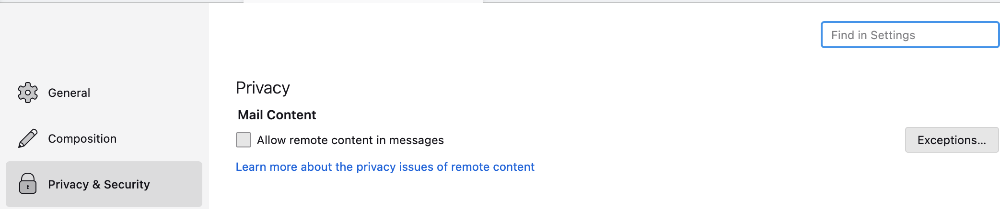
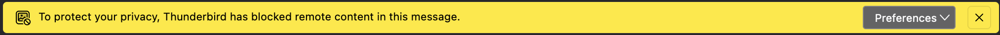
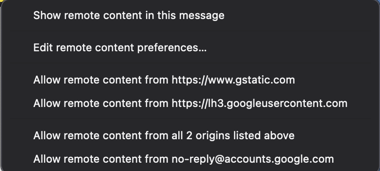
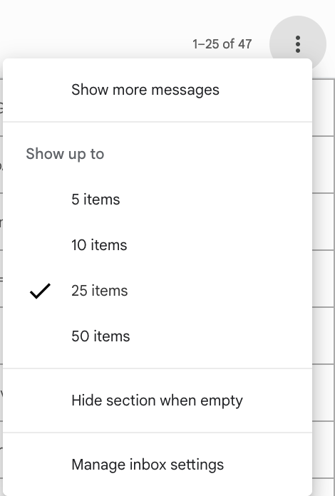
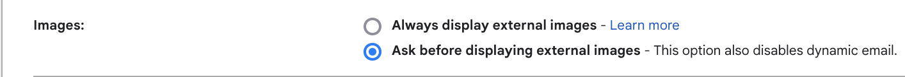
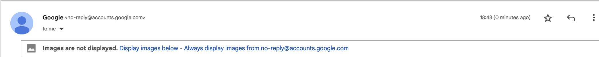

# Title
A guide to blocking email tracking pixels

# Summary
Tracking pixels are tiny, typically 1x1 pixels, images embedded in email messages that allow the collection of user data on email interactions, such as if a message has been opened or not, without the user's knowledge or consent. This practice can compromise your digital privacy by enabling the creation of a detailed user profile used for targeted advertising, allowing for intrusive and personalized data collection. In this guide you will learn how to prevent tracking pixels from phoning home and reporting your activity in several email clients.

# Body
Tracking pixels are a common online tracking technique used in email messages. They consist in embedding a unique, disguised or invisible, image in an email message to gather data about your interactions with it. 

When you open a message containing a tracking pixel, your email client makes a request to load the image so that it can display it to you: in practice, this request acts as a notification for the server. Since only you are served this exact pixel, when your email client requests it to display it, the server will know that you opened the message. This allows advertisers and other online entities to collect data on your email activity without your approval. 

The **only** way to prevent tracking pixels from being effective is by not loading them. This guide explains how to configure several mainstream email clients to disable remote image loading as a way to mitigate the privacy risks of tracking pixels.

### Mozilla Thunderbird

In Mozilla Thunderbird, go to **Settings > Privacy & Security** and disable **Allow remote content in messages**.

Now, every time you open an email message with remote content (e.g. images), Thunderbird will warn you and not load the remote content.

If you wish to display remote content in a particular message, or you wish to whitelist a domain that you trust, you can do so by clicking the **Preferences** menu that is displayed in the warning.

### Gmail web client

If you use the Gmail web client, you can disable remote content loading by going into your inbox settings. To do so, click the three vertical icons on the top right corner and then click on **Manage inbox settings**.

Then, go to the **General** tab and scroll down until you find the **Images** section, and select the **Ask before displaying external images** option.

Now, every time you open an email message with remote content (e.g. images), Gmail will warn you and not load the remote content.

If you wish to display remote content in a particular message you can click the **Display images below** option. If you wish to whitelist a domain that you trust, you can do so by clicking the **Always display images from**.

### Apple Mail

If you use Apple Mail client, you can disable remote content loading. In iOS, you can do so by going into **Settings > Mail**, scrolling down to the **Messages** section, and then clicking on **Privacy Protection**.

In this screen, you can toggle the option **Block All Remote Content** to avoid tracking pixels from being loaded when you open messages. If you wish to be able to load remote content, but still prevent it from being used to track you, you can enable the **Protect Mail Activity**. This option loads the remote content privately when you get a new message -- as opposed to loading it when you open it --, while simultaneously hiding sensitive data (e.g. your IP address), to hinder the effectiveness of tracking pixels.

In general, most email clients allow you to prevent loading of remote content. If you use an email client that is not listed here, refer to its user manual to learn how to do so. Typically, this option for disabling remote content is found under the general or privacy settings. Note that, since this is specific to a given email client, you should disable this option across all mail clients you use (e.g. on desktop, mobile, and web).