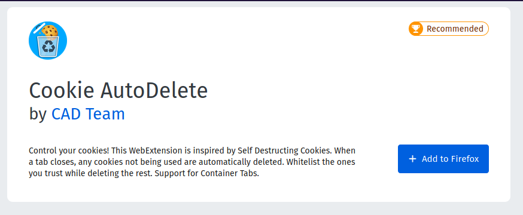
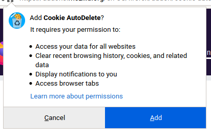
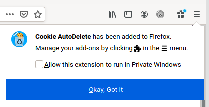
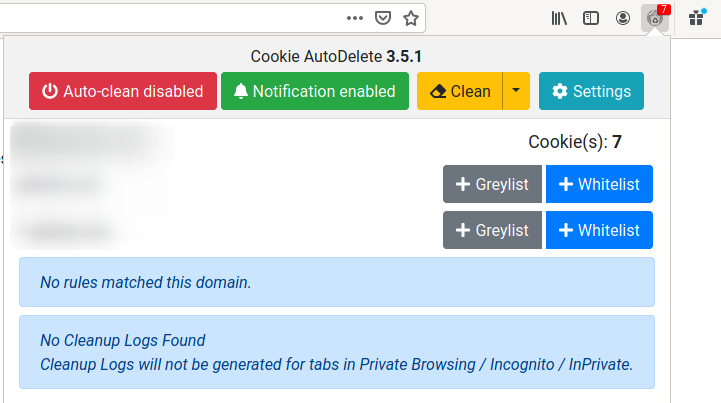

# Title #
Install a cookie manager on Firefox - Cookie AutoDelete

# Summary #

Browser cookies are a useful tool for websites to preserve your session data such as login credentials or items in your
shopping basket. Unfortunately, they are often abused to track your online activity across websites. In this guide
you'll learn how to install Cookie AutoDelete, a web-browser add-on to automatically delete unused cookies. By doing so,
when you visit a website, its cookies are unable to cross reference your activity on other websites.

### Installation ###

Like any other add-on, install Cookie AutoDelete by visiting the [Mozilla Firefox Add-ons
page](https://addons.mozilla.org/en-US/firefox/addon/cookie-autodelete/) and clicking **Add to Firefox** (Fig. 1) and
then clicking on **Add** when prompted (Fig. 2).

Upon successful installation a notification appears on the top-right corner, and the Cookie AutoDelete icon is added to
your toolbar (Fig. 3). When you visit a website, the Cookie AutoDelete icon shows the number of stored cookies for that
website. By clicking the icon (Fig. 4), you are able to clean cookies, and also whitelist (permanently) or greylist
(until a browser restart) websites you trust to store cookies.

After installation, we **strongly** advise you to enable Automatic Cleanup. You can do so by clicking the icon (Fig. 4)
and then clicking on **Auto-clean disabled**. That way, you don't have to remember to manually clean your cookies: when
you close a browser tab, any cookies not being used are automatically deleted.

Typically, you'd want to whitelist websites where you are logged-in frequently (e.g. email, social network) so that you
don't have to log-in each time you visit. However, we advise you **against** doing this, since whitelisted cookies may
still communicate with temporary cookies, and thus track your activity. Instead, we redirect you to our guide on Firefox
Multi-Containers, and advise you on creating a container for any domain which you'd want whitelisted. For this to work,
it's important to keep the setting **Enable Support for Firefox's Container Tabs** disabled (Fig. 5). This way, your
permanent cookies are isolated from your temporary cookies, preventing them from following your activity.
