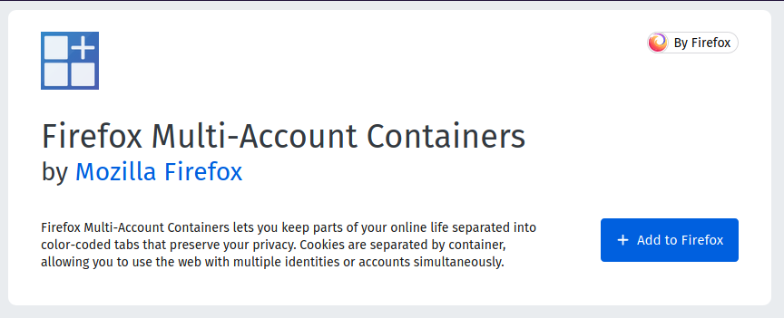
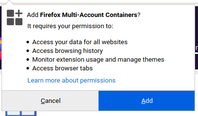
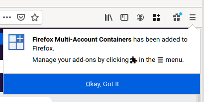
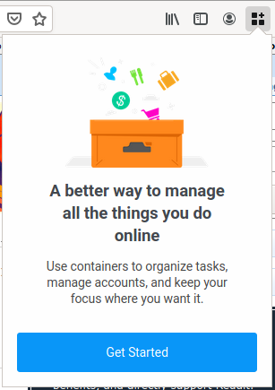

# Title #
Isolating your online activity - Firefox Multi-Account Containers

# Summary #
In general, you should store as few browsing cookies as possible on your device, to minimize tracking and improve your
online privacy. However, in websites such as your email client or your note-taking web application, it's practical to
have cookies stored so that you don't have to login each time you visit. In this guide you'll learn how to install and
setup Firefox Multi-Account Containers to keep parts of your online activity isolated from each other, thus reducing
your digital footprint.

# Body #

### Installation ###

Like any other add-on, install Firefox Multi-Account Containers by visiting the [Mozilla Firefox Add-ons
page](https://addons.mozilla.org/en-US/firefox/addon/multi-account-containers/) and clicking **Add to Firefox** (Fig. 1)
and then clicking on **Add** when prompted (Fig. 2).

Upon successful installation a notification appears on the top-right corner, and the Firefox Multi-Account Containers
icon is added to your toolbar (Fig. 3). The first time you click the icon you are presented with a guide to better
understand how the add-on works (Fig. 4).

You can now create containers for separate parts of your online activity. To create a container, click the icon and then
go to **Manage containers > New container**. Enter the name for your container and press OK (Fig. 4). Now, navigate to
the website you want to place in the container, click on the toolbar icon, and then click **Always Open This Site
in...** and select the container you just created. From now on, your online activity on that website will be isolated
from your regular web browsing. For more details on how to use Firefox Multi-Account Containers visit the [official
documentation](https://blog.mozilla.org/firefox/introducing-firefox-multi-account-containers/).

