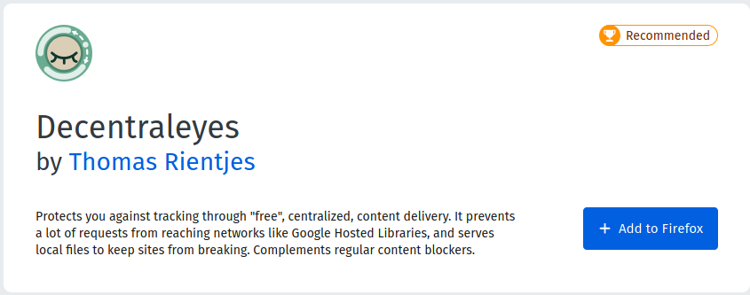
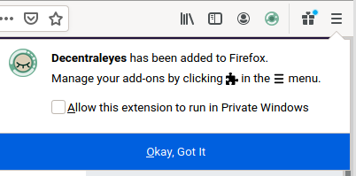
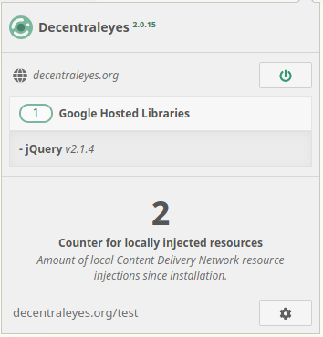

# Title  #
Install a CDN-emulator on Firefox - Decentraleyes

# Summary #

Websites are increasingly relying much more on large third-parties for content
delivery. As a result, such third-parties can track your online activity
while you browse the web. Decentraleyes is a browser add-on used for local
content delivery network (CDN) emulation, that protects your privacy by evading
large CDNs (e.g. Google). Decentraleyes blocks connections to CDNs, and instead
serves the assets (e.g. web libraries, fonts) locally, as opposed to from a
server.

In this guide, you'll learn how to install Decentraleyes on Firefox to prevent
CDNs from tracking your online activity.

### Installation ###
Like any other add-on, install Decentraleyes by visiting the [Mozilla Firefox
Add-ons page](https://addons.mozilla.org/en-US/firefox/addon/decentraleyes/) and
clicking **Add to Firefox** (Fig. 1) and then clicking on **Add** when prompted
(Fig. 2).

Upon successful installation a notification appears on the top-right corner, and
the Decentraleyes icon is added to your toolbar (Fig. 3). When you visit a
website, Decentraleyes automatically blocks connections to third-party CDNs and injects the assets locally, which you can check by clicking the icon (Fig. 4).

You can test the add-on by visiting the [Decentraleyes testing utility](https://decentraleyes.org/test/). If you
are interested in more advanced usage, visit the [official documentation page](https://git.synz.io/Synzvato/decentraleyes/-/wikis/).
