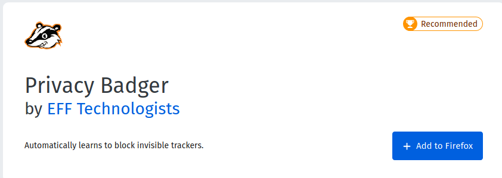
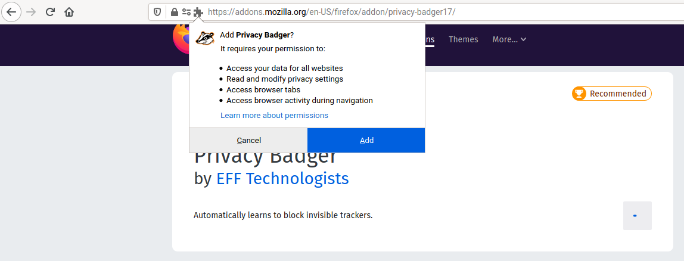
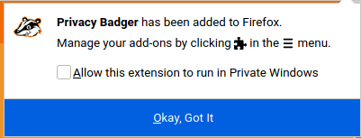
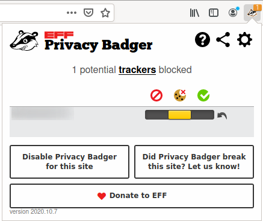
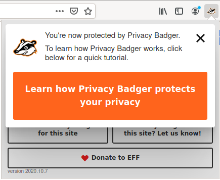

# Title  #
Install an ad-blocker on Firefox - Privacy Badger

# Summary #

<!-- Online tracking and advertisement services are a severe threat for your online -->
<!-- privacy, since they follow you everywhere and collect as much data as they can, -->
<!-- over which you have no control. As such, when browsing the web, it is critical -->
<!-- to block these services from communicating with our browser. -->

Privacy Badger is a browser add-on to block ads and trackers from tracking you.
It keeps an up-to-date list of known trackers that it finds through automated
tests, and regularly pushes the updated list to your browser. As such, it works
well alongside uBlock Origin, which keeps a manually curated list on malicious
services. Privacy Badger is a project of the Electronic Frontier Foundation and
has a strong [privacy policy](https://www.eff.org/code/privacy/policy).

In this guide, you'll learn how to install Privacy Badger on Firefox to block
malicious ads and trackers.

# Body #

### Installation ###

Like any other add-on, install Privacy Badger by visiting the [Mozilla Firefox
Add-ons page](https://addons.mozilla.org/en-US/firefox/addon/privacy-badger17/)
and clicking **Add to Firefox** (Fig. 1) and then clicking on **Add** when
prompted (Fig. 2).

Upon successful installation, a notification appears on the top-right corner and
the Privacy Badger icon is added to your toolbar (Fig. 3). When you visit a
website, Privacy Badger automatically blocks malicious trackers and ads, and
sets a privacy protection level (green, yellow, or red) which you can manually
adjust by clicking the toolbar icon (Fig. 4). To learn more about how Privacy
Badger works, click the icon and then click **Learn how Privacy Badger protects
your privacy** (Fig. 5), or visit its [official
documentation](https://privacybadger.org/).

