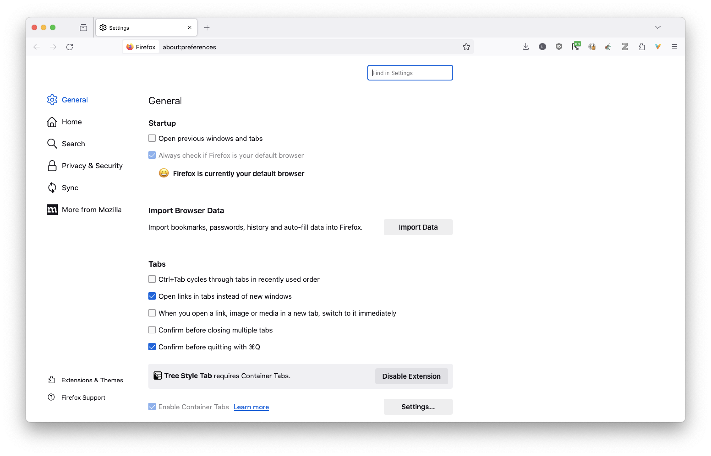
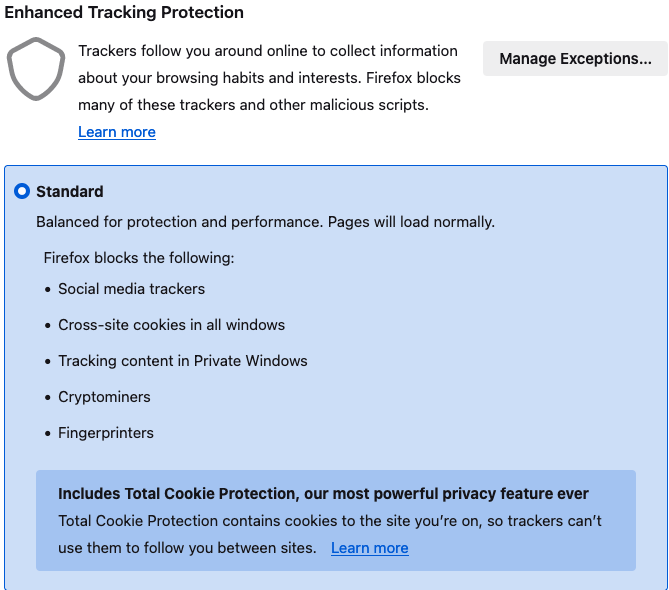
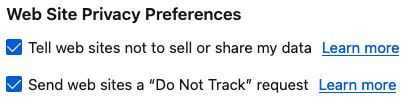
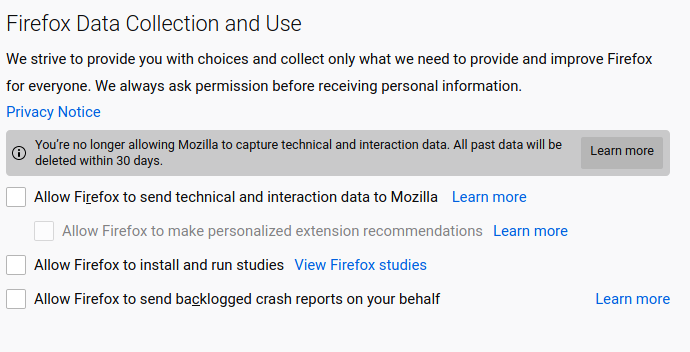
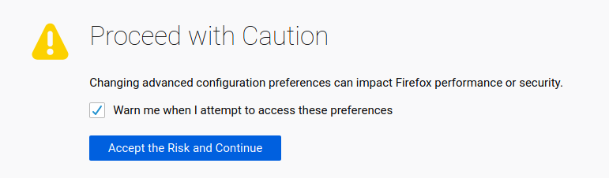
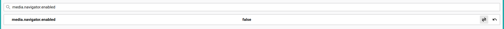

# Title #
Adjusting Firefox settings to enhance your online privacy

# Summary #
Firefox is well-known for respecting and protecting its users privacy. However, there are some changes which you could
apply to the default configuration to harden your online privacy. In this guide you'll learn how to configure your
Firefox browser settings to better protect your online activity.

# Body #

### Changing settings in Firefox menu ###
To change basic privacy settings in Firefox, access the preferences menu by clicking on **Edit > Preferences** on the menu-bar, or by
entering `about:preferences` in the URL bar, and then click on **Privacy & Security** (Fig. 1)

#### Enable content blocking ####
Content blocking should be enabled by default on your Firefox installation. If not, find the **Enhanced Tracking
Protection** setting and set it to **Standard** (Fig. 2). If you want stronger protection, we advise you to set it to **Strict**,
although this can break some pages from displaying correctly.

#### Enable Do Not Track ####
When browsing the web, your browser may warn websites that you do not want to be tracked. Beware that not all websites
respect this! For safer protection, please see our guide on installing an ad-blocker. Still, it's better to have this
option turned on. Scroll down until you see the **Send websites a "Do Not Track" signal that you don't want to be
tracked** and then click on **Always** (Fig. 3).

#### Disable telemetry services ###
To improve its services, Firefox collects technical and interaction data that it later sends to Mozilla for processing.
Part of this also includes the ability to remotely install extensions on your browser, which poses a serious privacy
risk. To disable telemetry services, find the section titled **Firefox Data Collection and Use** and make sure to un-tick all boxes (Fig. 4).

### Changing settings in the `about:config` page ###
To manage advance privacy settings, type `about:config` in the URL bar and press Enter. You'll then be greeted by a
warning stating that some settings may affect Firefox's performance and security (Fig. 5). Click **Accept the Risk and
Continue** to enter the settings page. .

The privacy settings you could apply in this page are presented below (Table 1). Next to each setting is the value you
should set it to, as well as a brief summary on what that setting concerns. To set an option, enter its name in the
search bar, and then double click to change the value. When you do so, the updated value is highlighted in bold and is
automatically saved (Fig. 6)

| Setting                                             | Value   | Why                                                                                               |
| :--                                                 | :--     | :--                                                                                               |
| `media.navigator.enabled`                           | `false` | Prevent websites from checking the status of your microphone and camera                           |
| `privacy.firstparty.isolate`                        | `true`  | Isolate first party domain cookies to reduce tracking across multiple websites                    |
| `privacy.trackingprotection.cryptomining.enabled`   | `true`  | Prevent websites from running crypto miners in your browser                                       |
| `privacy.trackingprotection.fingerprinting.enabled` | `true`  | Attempt to reduce your online fingerprint                                                         |
| `geo.enabled`                                       | `false` | Disable location services, since they go through Google's servers                                 |
| `network.prefetch-next`                             | `false` | Disable pre-fetching of webpages as this can pose a privacy risk                                  |
| `network.websocket.enabled`                         | `false` | If you use a VPN, the use of WebSockets can leak your real IP address                             |
| `dom.event.clipboardevents.enabled`                 | `false` | Prevent websites from getting a notification when you copy, cut, or paste something from the page |
| `media.peerconnection.enabled`                      | `false` | If you use a VPN, the use of WebRTC can leak your real IP address                                 |
| `dom.battery.enabled`                               | `false` | Prevent websites from reading your battery level                                                  |
| `browser.send_pings`                                | `false` | Prevent website from tracking your clicks on pages                                                |
| `browser.send_pings.require_same_host`              | `true`  | Allow click-tracking if send and receiving host match                                             |
| `extensions.pocket.enabled`                         | `false` | Disable Pocket integration                                                                        |

Table 1: Recommend settings to harden your browser privacy
